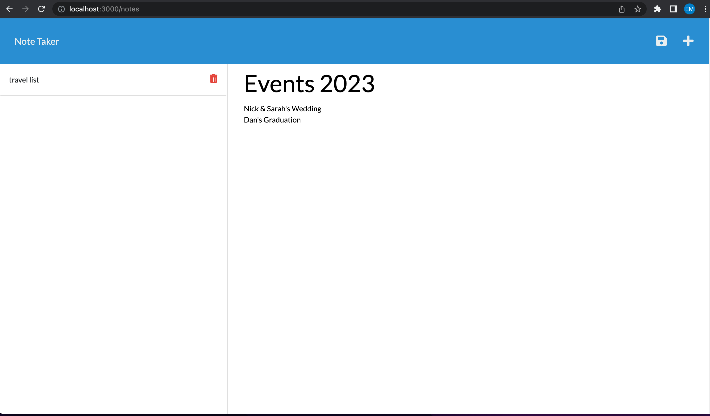

# Note Taker
This application makes it easy to keep a list of notes, thoughts, and whatever else you'd like to track of.  Users are also able to delete notes no longer needed.

# Project Status
Submitted for evaluation

# Project Deployed

https://github.com/EmilyBernard/Mod11-noteTaker
 
https://no-te-ta-ker.herokuapp.com/

# Starter Code
https://github.com/coding-boot-camp/miniature-eureka

# Screenshot of webpage

# User Story
AS A small business owner
I WANT to be able to write and save notes
SO THAT I can organize my thoughts and keep track of tasks I need to complete

# Original Assignment Criteria
<ul>
<li>GIVEN a note taking application
<li>WHEN I open the note taker
<li>THEN I am presented with a landing page with a link to a notes page
<li>WHEN I click on the link to the notes page
<li>THEN I am presented with a page with existing notes listed in the left-hand column, plus empty fields to enter a new note title and the note’s text in the right-hand column
<li>WHEN I enter a new note title and the note’s text
<li>THEN a Save icon appears in the navigation at the top of the page
<li>WHEN I click on the Save icon
<li>THEN the new note I have entered is saved and appears in the left-hand column with the other existing notes
<li>WHEN I click on an existing note in the list in the left-hand column
<li>THEN that note appears in the right-hand column
<li>WHEN I click on the Write icon in the navigation at the top of the page
<li>THEN I am presented with empty fields to enter a new note title and the note’s text in the right-hand column
</ul>

# Authors and acknowledgement
Emily Bernard
